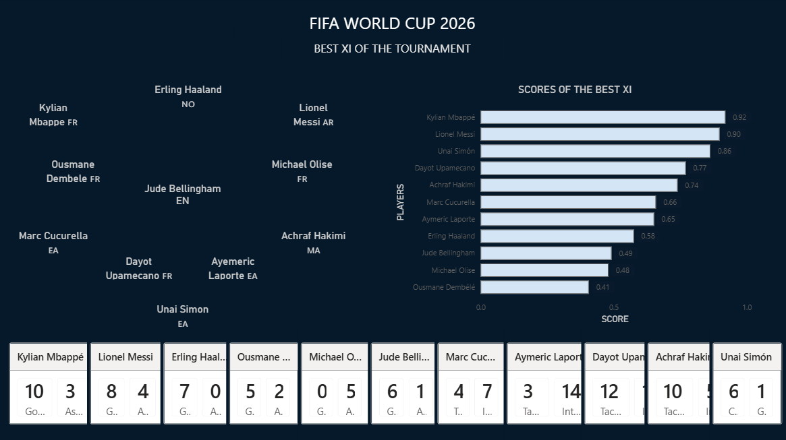

# FIFA World Cup Dream XI Analytics Platform

An end-to-end football analytics project that analyzes player performances and selects an optimized FIFA World Cup Dream XI using statistical performance data, custom scoring models, and Power BI visualization.

## Overview

The project evaluates football players across multiple performance dimensions, including:

- Shooting and goal contributions
- Goalkeeping performance
- Passing and overall play
- Playing time and availability
- Miscellaneous performance statistics

The collected data is cleaned, standardized, merged, and processed through a custom scoring framework to rank players by position and construct the final Dream XI.

## Methodology

The analytics pipeline follows these major steps:

```text
Raw Player Data
       |
       v
Data Cleaning
       |
       v
Data Merging and Standardization
       |
       v
Feature Scaling
       |
       v
Weighted Player Scoring
       |
       v
Position-wise Ranking
       |
       v
Dream XI Selection
       |
       v
Power BI Dashboard
```

Player performance is normalized using statistical techniques and evaluated using position-specific scoring weights. The highest-performing players are then selected to form the final Dream XI.

## Project Structure

```text
FWC-Dream-XI/
|
├── analysis/
│   ├── cleaning.py
│   ├── dream_xi.py
│   ├── merge.py
│   └── scoring.py
|
├── csv/
│   ├── goalkeeping.csv
│   ├── miscellaneous.csv
│   ├── shooting.csv
│   ├── standard.csv
│   └── time.csv
|
├── data/
│   ├── cleaned/
│   └── final/
|
├── dashboard/
│   ├── DreamXI.pbix
│   ├── index.html
│   └── powerbi_data/
|
├── images/
│   └── dashboard.png
|
├── prepare_powerbi_data.py
├── requirements.txt
└── README.md
```

## Power BI Dashboard

The project includes an interactive Power BI dashboard for exploring player performance, rankings, scoring weights, positional summaries, and the selected Dream XI.



## Dream XI Selection

The final XI is generated algorithmically using the project's scoring framework rather than subjective player selection.

The dashboard provides:

- Final Dream XI
- Position-wise player rankings
- Top-performing players
- Goalkeeper analysis
- Scoring-weight analysis
- Player performance comparisons

## Technology Stack

### Programming and Data Analysis

- Python
- Pandas
- NumPy
- Scikit-learn

### Visualization

- Microsoft Power BI

### Development Tools

- Git
- GitHub
- Visual Studio Code

## Key Features

- Automated data cleaning and preprocessing
- Multi-category football performance analysis
- Feature normalization and weighted scoring
- Position-specific player evaluation
- Automated Dream XI selection
- Interactive Power BI dashboard
- Exported datasets for dashboard integration

### Explore the Dashboard

Open `dashboard/DreamXI.pbix` using Microsoft Power BI Desktop.

## Project Objective

The objective of this project is to demonstrate how data analytics and visualization can be applied to football performance evaluation by transforming raw player statistics into meaningful rankings and an optimized Dream XI.

## Author

**Deepraj Kashyap**  
B.Tech, Electronics and Communication Engineering  
National Institute of Technology Silchar